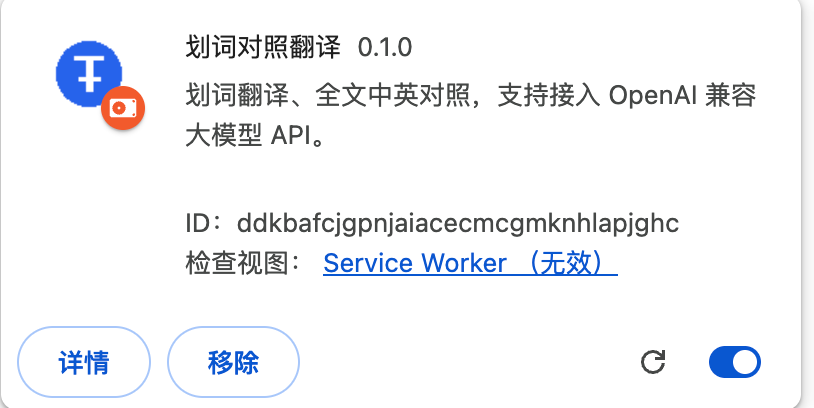
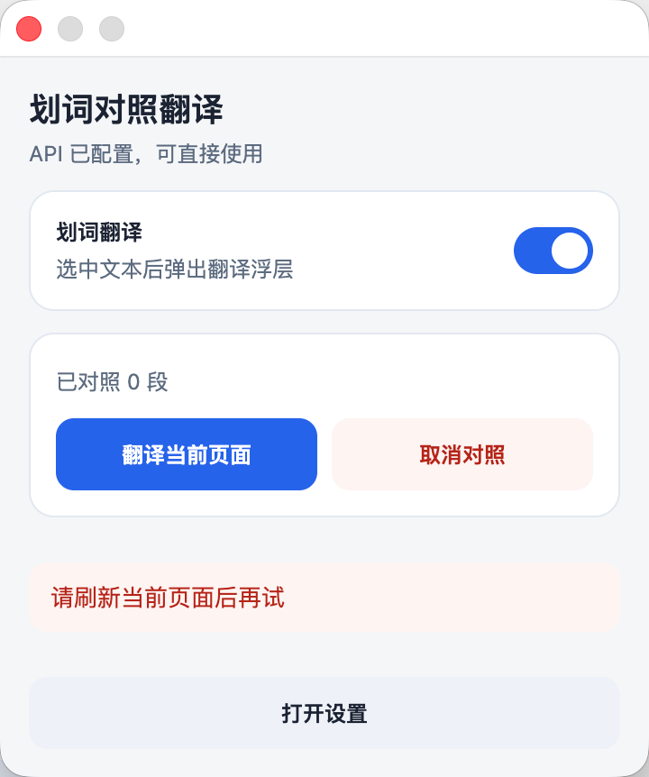
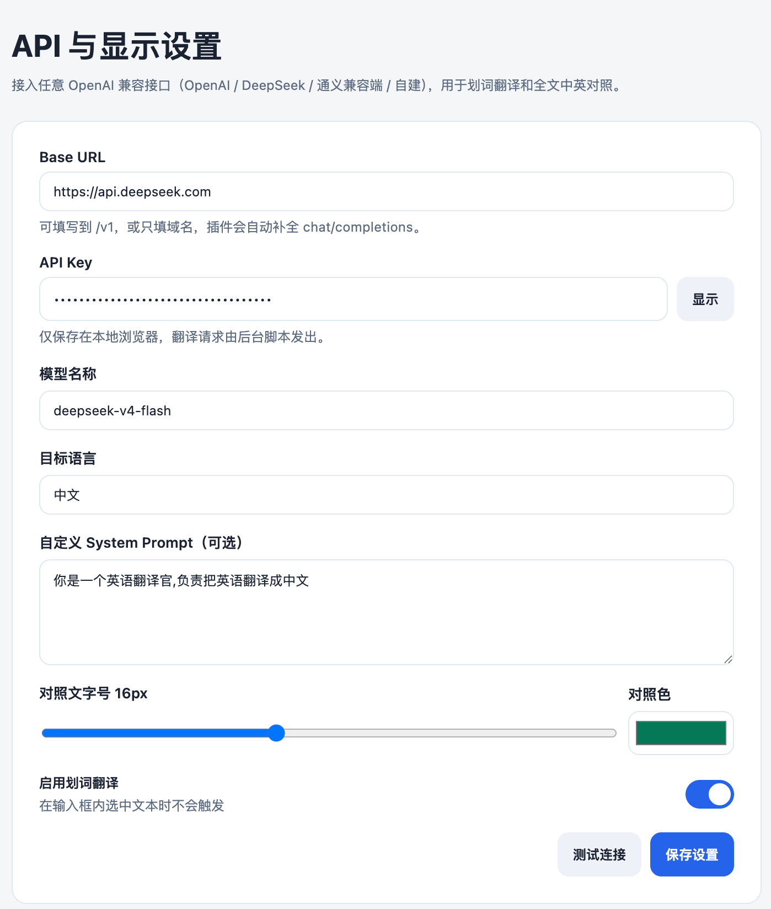

# 划词对照翻译

谷歌浏览器插件：划词翻译、全文中英对照，可自行接入 OpenAI 兼容大模型 API。

## 功能

- 划词后弹出浮层，将选中文本翻译成中文
- 右键菜单：翻译选中文本 / 翻译整个页面 / 取消页面翻译
- 在原英文段落下方插入中文，形成双语对照
- 设置页填写 Base URL、API Key、Model（兼容 OpenAI / DeepSeek / 通义兼容端 / 自建）

## 截图

扩展程序



Popup



设置页



## 开发 / 安装

```bash
npm install
npm run build
```

1. Chrome 打开 `chrome://extensions`
2. 开启「开发者模式」
3. 「加载已解压的扩展程序」，选择项目下的 `dist` 目录
4. 点击工具栏图标 →「打开设置」，填写 Base URL、API Key、模型名称，点「测试连接」

可用项目里的 [demo/index.html](demo/index.html) 做英文页划词和全文对照测试（可用任意本地静态服务打开）。

```bash
python3 -m http.server 8765 --directory demo
```

然后访问 `http://127.0.0.1:8765/`。
